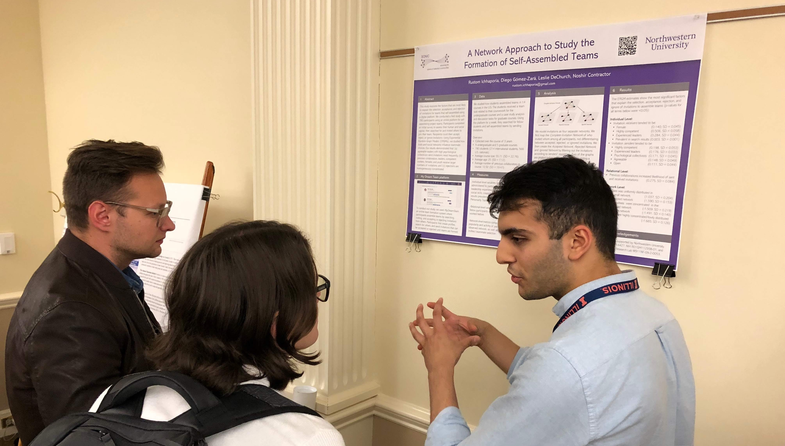
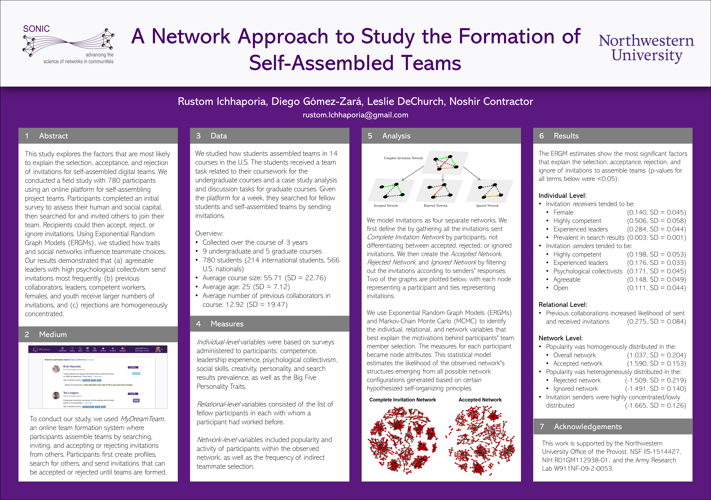

# Complex Networks and Online Team Self-Assembly

The repository contains samples of the code for my 2019 paper, "A Network Approach to the Formation of Self-assembled Teams", which was published by the International Conference on Complex Networks and Their Applications (Lisbon, Portugal) and presented at the 2019 Organizational Communication Mini-Conference (University of Illinois at Urbana-Champaign, IL). The code was written with researcher Diego Gómez-Zará, under the supervision of Dr. Noshir Contractor and Dr. Leslie DeChurch at Northwestern's SONIC Lab. The code is mainly written in R, and includes data preprocessing, exploratory data analysis, exponential random graph models (ERGMs), Cox regression machine learning models, and more. An abstract is pasted below: 

> Which individuals in a network make the most appealing teammates? Which invitations are most likely to be accepted? And which are most likely to be rejected? This study explores the factors that are most likely to explain the selection, acceptance, and rejection of invitations in self-assembling teams. We conducted a field study with 780 participants using an online platform that enables people to form teams. Participants completed an initial survey assessing traits, relationships, and skills. Next, they searched for and invited others to join a team. Recipients could then accept, reject, or ignore invitations. Using Exponential Random Graph Models (ERGMs), we studied how traits and social networks influence teammate choices. Our results demonstrated that (a) agreeable leaders with high psychological collectivism send invitations most frequently, (b) previous collaborators, leaders, competent workers, females, and younger individuals receive the most invitations, and (c) rejections are concentrated in the hands of a few.

The research I conducted at SONIC was months in the making, requiring me to learn a number of data science and statistical modeling tools (e.g. R, _ggplot_, RStudio, _statnet_, ERGMs). Apart from the intriguing findings of the study, I gained experience in scientific background research, arduous code debugging, git version control (most of which is not displayed in this public repo), and public presentation. Diego Gómez-Zará is continuing the research using the _MyDreamTeam_ platform at SONIC. Collaborating and discussing concepts with unfamiliar researchers was definitely a beneficial learning experience that I will be able to apply to future projects and research. I look forward to seeing what direction online team formation takes in the coming years of remote work. 

Please note that both the pre- and post-processed data for the project is not publicly available, so this code is just meant to represent the work I did during my time at SONIC. The research conducted using this code is not meant to be reproduced or copied. Please email me at rustom.ichhaporia@gmail.com with any questions. 

Links:
* Complex Networks Publication: https://link.springer.com/chapter/10.1007/978-3-030-36683-4_77
* OCMC Presentation: https://publish.illinois.edu/ocmc-2019/conference-presenters/
* SONIC Blurb: https://sonic.northwestern.edu/congrats-and-good-luck-rustom/

